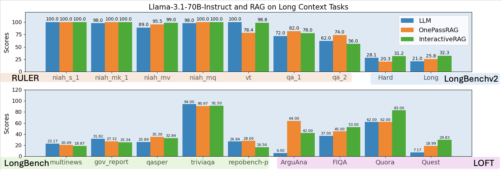

<div align="center">
<h1 style="font-size: 30px;"> GSM-Infinite: How Do Your LLMs Behave over Infinitely <br>Increasing Context Length and Reasoning Complexity?
</h1>
</div> 
GSM-Infinite is a reasoning benchmarks that is completely synthetic without LLMs in the loop, capable of generating problems of context length and reasoning complexity that are infinitely scalable. Inspired by <a href="https://arxiv.org/abs/2407.20311">Physics of Language Model 2.1</a>, we use abstract grade school level math problems in to computational graph and through graph manipulation and graph-language mapping to generate LLM-readable (also, Human-readable) problems. 

<div align="center">
<b><a href="https://github.com/YangZhou08">Yang Zhou*</a></b><sup>1</sup>,
<b><a href="">Hongyi Liu*</a></b><sup>1</sup>,
<b><a href="https://github.com/dreaming-panda">Zhuoming Chen</a></b><sup>1</sup>,
<b><a href="">Yuandong Tian</a></b><sup>2</sup>,
<b><a href="https://github.com/keroro824">Beidi Chen</a></b><sup>1</sup>,
</div> 
<div align="center">
*Equal Contributions, order decided by a coin flip 
</div> 
<div align="center">
<sup>1</sup>Carnegie Mellon University
<sup>2</sup>Meta AI 
</div>

<div align="center">
[<a href="">Paper</a>] | [<a href="https://infini-ai-lab.github.io/gsm_infinite/">Blog</a>] | [<a href=""><span class="icon">🤗</span>Leaderboards at huggingface</a>] 
</div> 

<h2>Limitation of Existing Long-context Benchmark</h2> 
<div align="center">

<figcaption>RAG can robustly solve most of today popular long-context benchmarks</figcaption> 
</div> 
In this paper, we first point out the insufficiencies in long-context LLMs evaluation, highlighting: 
<ol>
<li>
    <span style="font-weight: bold; color: dodgerblue">Lack of reasoning complexity</span>: Most tasks rely on text retrieval, text summarization, QA. 
</li>
<li>
    <span style="font-weight: bold; color: dodgerblue">Lack of context length</span>: Some tasks are inherently short-context tasks but are bloated to long-context through injecting semantically irrelevant noise. 
</li> 
<li> 
    3. <span style="font-weight: bold; color: dodgerblue">Lack of scalability</span>: Admittedly, tasks with high reasoning complexity and high information density exists, but these tasks requires huge human-effort to gather, dedup, and verify. The result is lack of scalability in quantity, making it hard to prevail in the community. 
</li> 
</ol> 
First two is further studied in the above figure. These tasks are not tasks that only long-context LLMs can do. We show that RAG are robust and have performance on par with long-context LLMs. However, given the high efficiency to build and run inference on RAG systems, RAG is more favorable in practice on these tasks. Therefore, we have the following problem to solve. 
<p>
    <span style="font-weight: bold; color: dodgerblue">Problem Statement</span>: How can we develop a benchmark that contains sufficient problems at every fine-grained level of reasoning difficulty, from easy retrieval tasks to infinitely hard challenges, while providing infinitely customizable context length with high information density? 
</p> 

<h2>GSM-Infinite</h2> 
<p>
We present GSM-\(\infty\), a benchmark with test examples completely synthesized, thus can scaled up infinitely in both context length and reasoning complexity. 
</p>

<p>
Importantly, the context length generated is high in information density, which can be seen from the following study in the Figure. 
</p> 
<div align="center">
 
<figcaption>RAG methods performance on GSM-Infinite.</figcaption> 
</div> 
(a) and (b) show that retriever, <a href="sentence-transformers/all-mpnet-base-v2">all-mpnet-base-v2</a>, cannot differentiate the close noise we generate from the essential block as they can comfortably do for vt in RULER. (c) and (d) show that retriever's performance is much lower in both Medium and Hard subset of GSM-Infinite than long-context LLMs, showing that the tasks are only Long-context LLM solvable. 

<h2>Leaderboards</h2> 
Here we provided both the Zero Noise and Long-context leader board. Since the Leaderboard will be updated from time to time. Please be sure to checkout our <a href="https://huggingface.co/spaces/BY7O0un8yig8O/leaderboard-example">huggingface space website</a> for the latest models and updates. 

Firstly, we evaluated 18 models on GSM-Infinite Zero Noise. The performance are as follows. 
| Models                | Symbolic | Medium  | Hard    | 1st<50% op on Hard | 1st<10% op on Hard | Avg. Acc op≤30 on Hard | Average↑  |
|-----------------------|----------|---------|---------|------------|------------|----------------|-----------|
| **DeepSeek-R1**       | 7280.0   | 9750.85 | 8573.8  | 100        | >130       | 0.9427         | 8534.88   |
| **GPT-o3-mini**       | 6690.0   | 8335.66 | 5769.96 | 70         | 110        | 0.9423         | 6931.88   |
| **GPT-o1-mini**       | 5060.0   | 6054.91 | 3738.43 | 50         | 90         | 0.8397         | 4951.11   |
| **DeepSeek-V3**       | 4310.0   | 4100.81 | 2407.86 | 24         | 55         | 0.6669         | 3606.22   |
| **QwQ-32B-preview**   | 3530.0   | 3205.75 | 1846.19 | 21         | 50         | 0.5403         | 2860.65   |
| **Gemini-1.5-Pro-002**| 2547.0   | 3659.59 | 2318.28 | 26         | 45         | 0.6924         | 2841.62   |
| **Claude-3.5-Sonnet** | 2161.0   | 3281.8  | 2115.79 | 26         | 40         | 0.6758         | 2519.53   |
| **Mistral-Large**     | 2332.5   | 2879.92 | 2310.49 | 25         | 40         | 0.6645         | 2507.64   |
| **Qwen2.5-72B-Instruct** | 2048.0 | 2496.81 | 2016.38 | 21         | 40         | 0.5433         | 2187.06   |
| **GPT-4o**            | 2379.0   | 2457.37 | 1451.54 | 18         | 30         | 0.5064         | 2095.97   |
| **Gemini-1.5-Flash-002** | 1970.0 | 1478.75 | 1274.25 | 19         | 30         | 0.4460         | 1574.33   |
| **Llama3.1-70B-Instruct** | 1769.0 | 1650.25 | 1205.25 | 10         | 30         | 0.4314         | 1541.50   |
| **MiniMax-Text-01**   | 1618.5   | 1712.64 | 1178.51 | 14         | 30         | 0.4213         | 1503.22   |
| **GPT-4o-mini**       | 1389.0   | 1406.5  | 913.89  | 12         | 22         | 0.3094         | 1236.46   |
| **Claude-3.5-Haiku**  | 897.0    | 1053.16 | 784.34  | 10         | 22         | 0.2910         | 911.50    |
| **Qwen2.5-7B-Instruct** | 786.95 | 886.75  | 618.5   | 7          | 16         | 0.2257         | 764.07    |
| **Llama3.1-8B-Instruct** | 462.0 | 786.5   | 606.5   | 6          | 17         | 0.2212         | 618.30    |
| **Jamba-1.5-Large**   | 856.0    | 485.13  | 466.4   | 6          | 26         | 0.1828         | 602.51    |

Secondly, we evaluated 11 models on GSM-Infinite long-context tasks. 
| Model                     | 8K      | 16K     | 32K     | Average↑ |
|---------------------------|---------|---------|---------|----------|
| **gemini-1.5-pro-002**        | 1182.43 | 896.31  | 812.96  | 963.9    |
| **qwen-2.5-72b-instruct**     | 927.33  | 681.53  | 563.65  | 724.17   |
| **mistral-large-2411**        | 914.49  | 563.73  | 319.21  | 599.14   |
| **deepseek-v3**               | 935.10  | 477.02  | 313.66  | 575.2    |
| **gemini-1.5-flash-002**      | 673.88  | 476.72  | 377.38  | 509.3    |
| **llama-3.1-70b-instruct**    | 479.00  | 394.50  | 355.5   | 409.67   |
| **minimax-text-01**           | 481.32  | 359.56  | 325.95  | 388.94   |
| **gpt-4o-mini**               | 401.00  | 337.81  | 275.63  | 338.15   |
| **qwen-2.5-7b-instruct**      | 248.00  | 211.50  | 196.17  | 218.56   |
| **llama-3.1-8b-instruct**     | 183.67  | 149.50  | 109.45  | 147.54   | 

We present detailed description of data generation and evaluation findings uniquely benefited from the design of GSM-Infinite. <span style="font-weight: bold; color: dodgerblue">Please make sure to checkout our paper. </span> 

<h2>Overview of the Code Organization</h2> 
From the paper, we have three subtasks in GSM-Infinite. We have Symbolic, Medium, and Hard. The classification is mainly about semantic hierarchy. More details in the paper. Below is a menu of the organization of files and folders. 

- [Symbolic](#symbolic)
  - [Data](#symbolic-data)
  - [Predictions](#symbolic-predictions)
- [Realistic](#realistic)
  - [Data](#realistic-data)
  - [Predictions](#realistic-predictions) 

The main components of the code are data generation and model evaluation scripts. Since there are some subtle differences between these two. We separate them into two different folders. 

<h3>Environment Installation</h3> 

```
pip install -r requirements.txt 
``` 
If you want to serve model locally, please install platforms of your choice (vllm, sglang, etc.). 

<h3>Generation and Evaluation of Symbolic Dataset</h3> 
For both the datasets, we have sampled dataset generated and uploaded to huggingface public datasets, which you can download and try. However, we also provide necessary code to generate the data locally. 

Under `\Symbolic` subset, go in to `run.sh` and fill in necessary api credentials, model name, and dataset selection configs. You can directly run to use the existing datasets on the huggingface. 
``` 
bash -x run.sh 
```

<h3>Generation and Evaluation of Symbolic Dataset</h3> 

Under `\realistic` subset, go to `pred` folder, and then open `evaluate_script_template.sh` to fill in the api credentials, model name, and dataset selection configs. Then, hit 
``` 
bash -x evaluate_script_template.sh 
```

If you want to generate the data yourself, please feel free to look into the `data` folder, and look into the `test_generate3.sh`. Then, fill in your dataset settings (ops, context length). Try hitting 
``` 
bash -x test_generate3.sh 
``` 
