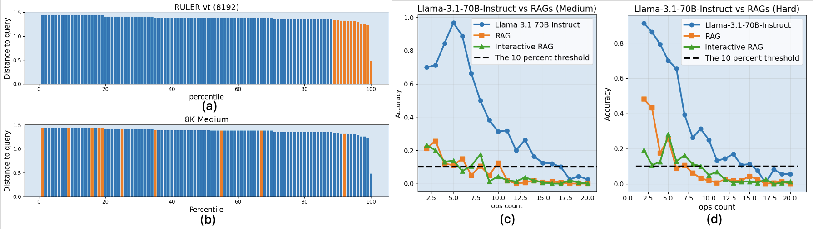

# GSM-Infinite Leaderboards

This document contains the current leaderboards for GSM-Infinite benchmark results. For the most up-to-date results, please visit our [interactive leaderboard](https://infiniailab-gsm-infinite-leaderboard.hf.space).

## Zero Noise Leaderboard

The following table shows model performance on GSM-Infinite Zero Noise tasks, which test reasoning ability without additional context length challenges.

| Models                | Symbolic | Medium  | Hard    | 1st<50% op on Hard | 1st<10% op on Hard | Avg. Acc op≤30 on Hard | Average↑  |
|-----------------------|----------|---------|---------|------------|------------|----------------|-----------|
| **DeepSeek-R1**       | 7280.0   | 9750.85 | 8573.8  | 100        | >130       | 0.9427         | 8534.88   |
| **GPT-o3-mini**       | 6690.0   | 8335.66 | 5769.96 | 70         | 110        | 0.9423         | 6931.88   |
| **GPT-o1-mini**       | 5060.0   | 6054.91 | 3738.43 | 50         | 90         | 0.8397         | 4951.11   |
| **DeepSeek-V3**       | 4310.0   | 4100.81 | 2407.86 | 24         | 55         | 0.6669         | 3606.22   |
| **QwQ-32B-preview**   | 3530.0   | 3205.75 | 1846.19 | 21         | 50         | 0.5403         | 2860.65   |
| **Gemini-1.5-Pro-002**| 2547.0   | 3659.59 | 2318.28 | 26         | 45         | 0.6924         | 2841.62   |
| **Claude-3.5-Sonnet** | 2161.0   | 3281.8  | 2115.79 | 26         | 40         | 0.6758         | 2519.53   |
| **Mistral-Large**     | 2332.5   | 2879.92 | 2310.49 | 25         | 40         | 0.6645         | 2507.64   |
| **Qwen2.5-72B-Instruct** | 2048.0 | 2496.81 | 2016.38 | 21         | 40         | 0.5433         | 2187.06   |
| **GPT-4o**            | 2379.0   | 2457.37 | 1451.54 | 18         | 30         | 0.5064         | 2095.97   |
| **Gemini-1.5-Flash-002** | 1970.0 | 1478.75 | 1274.25 | 19         | 30         | 0.4460         | 1574.33   |
| **Llama3.1-70B-Instruct** | 1769.0 | 1650.25 | 1205.25 | 10         | 30         | 0.4314         | 1541.50   |
| **MiniMax-Text-01**   | 1618.5   | 1712.64 | 1178.51 | 14         | 30         | 0.4213         | 1503.22   |
| **GPT-4o-mini**       | 1389.0   | 1406.5  | 913.89  | 12         | 22         | 0.3094         | 1236.46   |
| **Claude-3.5-Haiku**  | 897.0    | 1053.16 | 784.34  | 10         | 22         | 0.2910         | 911.50    |
| **Qwen2.5-7B-Instruct** | 786.95 | 886.75  | 618.5   | 7          | 16         | 0.2257         | 764.07    |
| **Llama3.1-8B-Instruct** | 462.0 | 786.5   | 606.5   | 6          | 17         | 0.2212         | 618.30    |
| **Jamba-1.5-Large**   | 856.0    | 485.13  | 466.4   | 6          | 26         | 0.1828         | 602.51    |

### Metric Explanations

- **Symbolic**: Performance on abstract mathematical operations
- **Medium**: Performance on realistic word problems  
- **Hard**: Performance on complex multi-step problems
- **1st<50% op on Hard**: First operation count where accuracy drops below 50% on Hard subset
- **1st<10% op on Hard**: First operation count where accuracy drops below 10% on Hard subset
- **Avg. Acc op≤30 on Hard**: Average accuracy for operations ≤30 on Hard subset
- **Average↑**: Overall average score across all metrics

## Long-Context Leaderboard

The following table shows model performance on GSM-Infinite long-context tasks, testing reasoning ability with increasing context lengths.

| Model                     | 8K      | 16K     | 32K     | Average↑ |
|---------------------------|---------|---------|---------|----------|
| **gemini-1.5-pro-002**        | 1182.43 | 896.31  | 812.96  | 963.9    |
| **qwen-2.5-72b-instruct**     | 927.33  | 681.53  | 563.65  | 724.17   |
| **mistral-large-2411**        | 914.49  | 563.73  | 319.21  | 599.14   |
| **deepseek-v3**               | 935.10  | 477.02  | 313.66  | 575.2    |
| **gemini-1.5-flash-002**      | 673.88  | 476.72  | 377.38  | 509.3    |
| **llama-3.1-70b-instruct**    | 479.00  | 394.50  | 355.5   | 409.67   |
| **minimax-text-01**           | 481.32  | 359.56  | 325.95  | 388.94   |
| **gpt-4o-mini**               | 401.00  | 337.81  | 275.63  | 338.15   |
| **qwen-2.5-7b-instruct**      | 248.00  | 211.50  | 196.17  | 218.56   |
| **llama-3.1-8b-instruct**     | 183.67  | 149.50  | 109.45  | 147.54   |

### Context Length Analysis

The long-context results reveal several important patterns:

1. **Performance Degradation**: Most models show significant performance drops as context length increases
2. **Model Size Correlation**: Larger models generally maintain performance better across context lengths
3. **Architecture Differences**: Some architectures handle long contexts more effectively than others

## Key Insights

### Why RAG Systems Fail

<em>RAG methods performance comparison on GSM-Infinite</em>

Our analysis shows that traditional RAG systems cannot solve GSM-Infinite problems because:

1. **High Information Density**: Every part of the context contains essential information
2. **Complex Dependencies**: Solutions require understanding relationships across the entire context
3. **Reasoning Requirements**: Problems demand multi-step mathematical reasoning, not just retrieval

### Model Performance Patterns

1. **Reasoning Models Excel**: Models with explicit reasoning capabilities (o1, o3, DeepSeek-R1) significantly outperform others
2. **Scale Matters**: Larger models generally perform better, but architecture is equally important
3. **Context Length Challenges**: Even the best models struggle with very long contexts (32K+ tokens)

## Evaluation Methodology

### Datasets Used

- **Symbolic**: Abstract mathematical operations with computational graphs
- **Medium**: Realistic word problems with moderate complexity
- **Hard**: Complex multi-step problems requiring deep reasoning

### Evaluation Metrics

- **Accuracy**: Percentage of correctly solved problems
- **Operation Scaling**: How performance changes with problem complexity
- **Context Length Scaling**: How performance changes with input length

### Evaluation Process

1. **Problem Generation**: Synthetic problems generated without LLM involvement
2. **Model Inference**: Models generate solutions using their standard inference process
3. **Answer Extraction**: Automated extraction of final answers from model responses
4. **Scoring**: Exact match comparison with ground truth answers

## Submitting Results

To submit your model's results to the leaderboard:

1. **Run Evaluation**: Use our evaluation scripts to test your model
2. **Verify Results**: Ensure your results are reproducible
3. **Submit**: Create a pull request with your results or contact us directly

### Submission Requirements

- Complete evaluation on all three subsets (Symbolic, Medium, Hard)
- Results for multiple context lengths (0, 8K, 16K, 32K tokens)
- Detailed methodology and model information
- Reproducible evaluation scripts

<!-- ## Historical Results

For historical leaderboard data and trend analysis, please visit our [interactive leaderboard](https://infiniailab-gsm-infinite-leaderboard.hf.space) which provides:

- Time-series analysis of model improvements
- Detailed breakdown by problem categories
- Interactive filtering and comparison tools
- Export capabilities for further analysis -->

<!-- ## Updates and Maintenance

This leaderboard is updated regularly as new models are evaluated. For the most current results:

1. Visit our [interactive leaderboard](https://infiniailab-gsm-infinite-leaderboard.hf.space)
2. Check our [GitHub repository](https://github.com/Infini-AI-Lab/gsm_infinite) for updates
3. Follow our announcements for major leaderboard updates -->

---

*Last updated: February 2025*  
*For questions about the leaderboard, please contact [yangzho6@andrew.cmu.edu](mailto:yangzho6@andrew.cmu.edu)*

